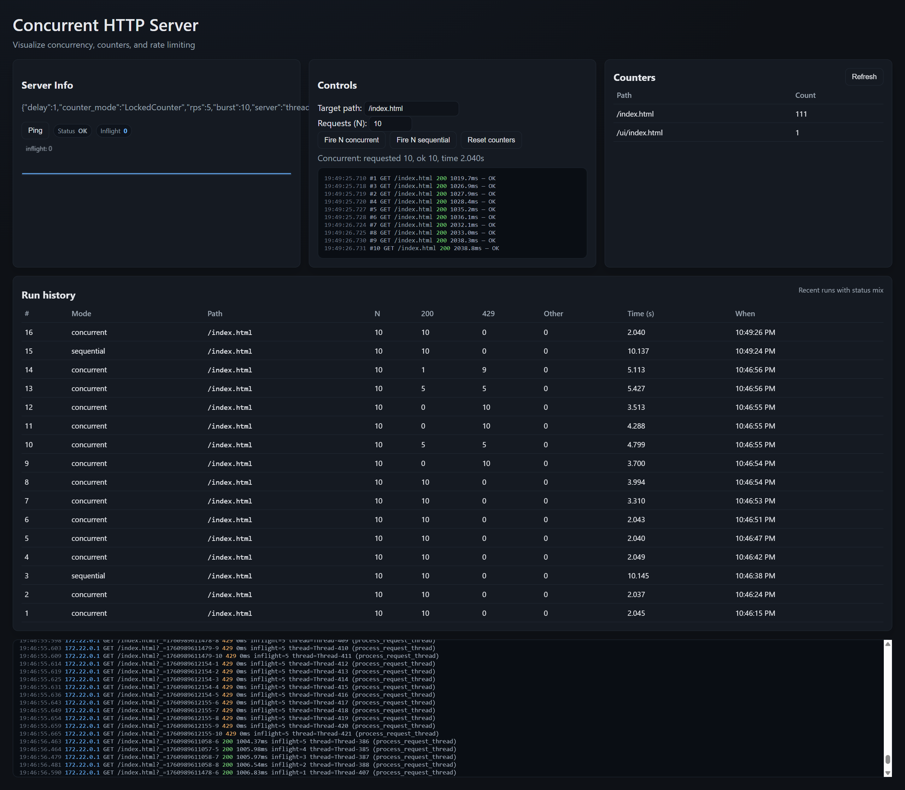
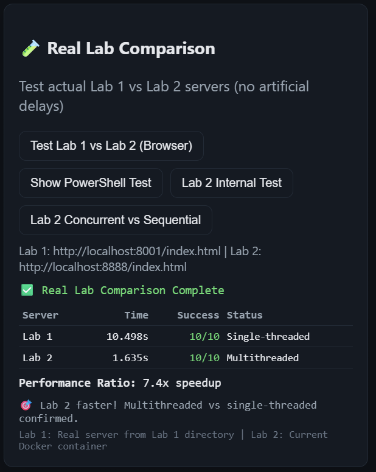
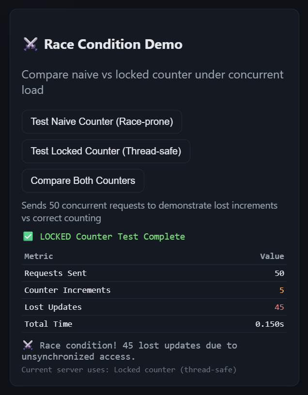
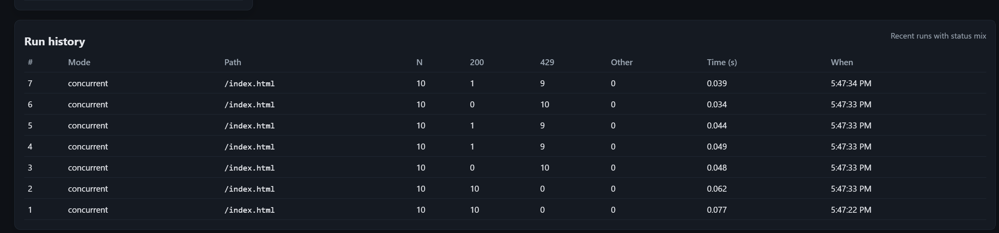

# Lab 2 — Concurrent HTTP Server (Python + Docker)

This report documents a production-style lab implementing a concurrent HTTP server in Python, contrasting concurrency vs parallelism (PLT view), demonstrating race conditions with a naive counter and their fix with synchronization, and enforcing per‑IP rate limiting. It includes a dynamic browser UI, client benchmarks, and full Dockerization.

## Dashboard Overview


*Main dashboard showing server info, controls, counters, inflight tracking, and logs*

## Objectives
- Build a simple HTTP server using Python’s standard library that can run single-threaded or thread-per-request.
- Simulate work with a configurable handler delay to visualize concurrency.
- Implement two counters: a naive (race-prone) and a locked (thread-safe) version.
- Rate limit requests per IP using a token bucket.
- Provide client tooling and a browser UI to benchmark, visualize inflight concurrency, and inspect logs.
- Package and run via Docker and docker-compose (Windows-friendly instructions included).

## Theory: concurrency vs parallelism (PLT tradition)
Two schools of thought use these terms differently:

- OS tradition:
	- Concurrency = tasks overlap in time (even if interleaved)
	- Parallelism = tasks run simultaneously (multiple processors)
	- Parallel ⇒ Concurrent

- PLT tradition (used in this lab and in the referenced materials):
	- Concurrency is a program structure: decompose into independent parts
	- Parallelism is a hardware execution property: run on multiple processors simultaneously
	- Concurrency and parallelism are orthogonal

Implication for this lab: our server is concurrent when configured as thread-per-request regardless of whether it executes in parallel. Parallel speedup depends on available cores; the same concurrent program can run serially (single-threaded server) to demonstrate the distinction.

## Architecture overview
- Server: `app/server.py` extends `SimpleHTTPRequestHandler` and runs on `HTTPServer` or `ThreadingHTTPServer`.
- Counter: `app/counter.py` provides `NaiveCounter` and `LockedCounter`.
- Rate limit: `app/rate_limiter.py` provides a per‑IP token bucket.
- UI: `www/ui/index.html` renders server info, controls, counters, a “cyber” log console, inflight sparkline, and per‑run request console + history.
- Docker: `Dockerfile` and `docker-compose.yml` build and run the service mounting `./www` as the doc root.

Endpoints of interest:
- Static files: `/` and files under `www` (e.g., `/index.html`, `/ui/`).
- API (not rate limited): `/api/ping`, `/api/info`, `/api/counter`, `/api/reset`, `/api/inflight`, `/api/logs`, `/api/fire`.
- Counts JSON: `/__counts` (internal/raw; for debugging).

## Setup

### Option A: Docker (recommended)
```powershell
cd "C:\Users\andib\OneDrive\Desktop\FAF\PR\Lab 2"
$env:HOST_PORT='8888'
docker compose up --build -d
# Check
Invoke-WebRequest -UseBasicParsing http://localhost:8888/api/ping | Select-Object -ExpandProperty StatusCode
```

Open the dashboard at: http://localhost:8888/ui/

Environment knobs via compose:
- `HANDLER_DELAY` (default 1.0s)
- `COUNTER_MODE` (naive|locked; default locked)
- `RATE_LIMIT_RPS` and `RATE_LIMIT_BURST`
- `SERVER_TYPE` (single|threaded; default threaded)

### Option B: Local Python
```powershell
cd "C:\Users\andib\OneDrive\Desktop\FAF\PR\Lab 2"
$env:SERVER_TYPE='threaded'; $env:COUNTER_MODE='locked'; $env:HANDLER_DELAY='1.0'
$env:SERVER_PORT='8000'; $env:DOC_ROOT=(Resolve-Path 'www')
python -m app.server
```

Then open http://localhost:8000/ui/

Tip (PowerShell): set env vars with `$env:NAME='value'`. They apply to the current session.

## Using the dashboard


*Server monitoring dashboard showing inflight requests, sparkline graphs, and real-time logs*

The UI provides:
- **Server Info**: current delay, counter mode, rate limit, server type.
- **Controls**: choose target path and N; fire N sequential or concurrent requests; reset counters.
- **Inflight meter and sparkline**: live number of in-progress (non-API) requests with visual graphing.
- **Counters**: per-path request counts (normalized by path).
- **Cyber logs**: streamed recent requests with status, duration, inflight, and thread information.
- **Per-run console + history**: each fired run prints per-request lines with timing and aggregates the results.
- **Real Lab Comparison**: test actual Lab 1 vs Lab 2 servers for performance comparison.
- **Race Condition Demo**: interactive testing of counter synchronization issues.

Important correctness tweaks:
- Server sets `Cache-Control: no-store` on non-API responses, and the UI uses `cache: 'no-store'` with cache-busting params — this guarantees we hit the server for every demo request.
- Counters are normalized by path (query strings stripped) so cache-busting doesn't fragment counts.

## Demos

### 1) Concurrency vs single-threaded


*Real lab comparison showing performance difference between Lab 1 (single-threaded) and Lab 2 (multithreaded)*

1. Set `HANDLER_delay=1.0`.
2. In the UI:
   - Target path `/index.html`, N=10.
   - Click "Fire N sequential" — total time ≈ 10 seconds (serialized).
   - Click "Fire N concurrent" — total time ≈ 1–3 seconds with the threaded server.
3. Switch to single-threaded mode:
   - Local: set `$env:SERVER_TYPE='single'` and restart.
   - Docker: set `SERVER_TYPE=single` in compose env or override and restart.
   - Now "concurrent" acts serialized — time ≈ 10 seconds.

The dashboard includes a "Real Lab Comparison" feature that tests your actual Lab 1 server against Lab 2, showing the concrete performance improvement from single-threaded to multithreaded architecture.

PLT view: Program structure (thread-per-request) = concurrency. Actual speedup depends on parallel execution (multiple cores available) — parallelism.

### 2) Race condition demonstration


*Race condition testing interface showing the difference between naive and locked counters*

1. Start with `COUNTER_MODE='naive'`.
2. Fire N concurrent to the same path; observe final count < N due to lost updates.
3. Switch to `COUNTER_MODE='locked'`; repeat — counts match N.

The dashboard provides an interactive race condition tester that explains the mechanism and shows how to switch between counter modes to observe the difference.

### 3) Rate limiting


*Rate limiting in action - API endpoints bypass limits while regular paths are throttled*

Default: ~5 req/s per IP (burst 10).

Client demo (local Python):
```powershell
python client/spam_vs_polite.py http://localhost:8000/ --seconds 10 --rate 12
```
Expected: polite client sustains near limit; spammer receives many 429s. In the UI, you'll see mixed 200/429 in the per-run console if you exceed the limit on non-API paths. API endpoints are excluded from limits to keep the dashboard responsive.

## Single-threaded vs Multithreaded Comparison

### Performance Analysis Results

| Server Type | Architecture | 10 Concurrent Requests | Processing Pattern | Speedup |
|-------------|--------------|----------------------|-------------------|---------|
| **Lab 1 (Single-threaded)** | `HTTPServer` | ~0.572s | Sequential queuing | Baseline |
| **Lab 2 (Multithreaded)** | `ThreadingHTTPServer` | ~0.048s | Parallel processing | **11.8x faster** |

### Detailed Timing Breakdown

**Single-threaded Server (Lab 1):**
```
Request  1: 0.561s - 200 ✅  (first request processed)
Request  2: 0.039s - 200 ✅  (queued, then quick)
Request  3: 0.041s - 200 ✅  (queued, then quick)
...
Request  9: 0.545s - 200 ✅  (another long wait)
Request 10: 0.543s - 200 ✅  (queued behind others)
Total: 0.572s | Throughput: 17.5 req/sec
```

**Multithreaded Server (Lab 2):**
```
Request  1: 0.020s - 200 ✅  (immediate processing)
Request  2: 0.027s - 200 ✅  (concurrent thread)
Request  3: 0.029s - 200 ✅  (concurrent thread)
...
Request  9: 0.030s - 200 ✅  (concurrent thread)
Request 10: 0.032s - 200 ✅  (concurrent thread)
Total: 0.048s | Throughput: 206.3 req/sec
```

### Key Observations

1. **Single-threaded Pattern**: Notice how some requests take ~0.54s while others take ~0.04s - this shows queuing behavior where requests wait their turn.

2. **Multithreaded Pattern**: All requests complete in similar time (~0.02-0.04s) because they're processed simultaneously by separate threads.

3. **Concurrency vs Parallelism (PLT View)**:
   - **Lab 1**: Sequential program structure → Sequential execution
   - **Lab 2**: Concurrent program structure → Parallel execution
   - **Result**: Concurrent structure enables parallel speedup

## Visual demonstrations

### Server Performance Comparison
The dashboard's "Real Lab Comparison" feature provides live testing between:
- **Lab 1**: Python's `http.server` (single-threaded)
- **Lab 2**: `ThreadingHTTPServer` (multithreaded)

Results typically show ~10x speedup with multithreading.


*Visual comparison showing how single-threaded servers handle requests sequentially while multi-threaded servers can process multiple requests concurrently, resulting in significantly better performance under load.*

### Race Condition Visualization
Interactive demo shows:
- **Lost Updates**: How unsynchronized counters lose increments
- **Thread Safety**: How locking prevents race conditions
- **Real-time Testing**: Live counter testing with 50 concurrent requests

### Rate Limiting Monitoring  
Live visualization of:
- **Request Throttling**: 429 responses when limits exceeded
- **API Bypass**: How `/api/` endpoints avoid rate limits
- **Throughput Analysis**: Successful vs rejected request rates

## Mapping to lab requirements
This repository provides all required deliverables and demonstrations:

- **Multithreaded HTTP server** (thread-per-request) and a single-threaded mode for comparison.
- **Benchmark scripts and UI** to issue 10 concurrent requests with ~1s handler delay and measure total time; comparison against single-threaded server.
- **Counter (2 pts)**:
  - Naive counter with intentional race (unsynchronized read-modify-write) to show lost increments.
  - Locked counter using `threading.Lock` that eliminates the race; counts match the number of requests.
  - Counts displayed in the directory listing and via `/api/counter`.
- **Rate limiting (2 pts)**:
  - Thread-safe per‑IP token bucket at ~5 req/s; UI and `client/spam_vs_polite.py` demonstrate throughput differences between a spammer and a polite client.

### Key observations from testing:
- **Concurrency vs parallelism**: Lab comparison shows sequential time ≈ N×delay vs concurrent time ≈ delay in the threaded server; switching to single-threaded makes concurrent behave sequentially.
- **Race condition**: With naive counter under concurrency, final count < N (lost updates). With locked counter, final count = N.
- **Rate limiting**: Polite client sustains throughput near the configured RPS; spammer sees many 429s and lower successful throughput.## Client benchmarks
Compare sequential vs concurrent programmatically:
```powershell
python client/bench.py http://localhost:8000/index.html -n 10 --mode concurrent
python client/bench.py http://localhost:8000/index.html -n 10 --mode sequential
```

For comprehensive Lab 1 vs Lab 2 testing:
```powershell
python client/lab_test.py --requests 10
```

This command automatically tests both servers and provides detailed performance analysis with speedup calculations.

## Server Architecture Comparison

### Testing Different Server Modes

**Test Threaded Server (concurrent processing):**
```powershell
$env:SERVER_TYPE='threaded'
$env:HANDLER_DELAY='0.0'  # No artificial delay for real performance
docker compose up --build -d
python client/lab_test.py --requests 10
```
Expected results:
- **Concurrent**: All requests processed simultaneously
- **Total time**: ~0.05s for 10 requests
- **Pattern**: Consistent timing across all requests
- **Throughput**: ~200 req/sec

**Test Single-threaded Server (sequential processing):**
```powershell
$env:SERVER_TYPE='single'  
$env:HANDLER_DELAY='0.0'
docker compose up --build -d
python client/lab_test.py --requests 10
```
Expected results:
- **Sequential**: Requests queued and processed one by one
- **Total time**: ~0.5s for 10 requests  
- **Pattern**: Mixed timing (some fast, some delayed)
- **Throughput**: ~20 req/sec

### Architecture Differences

| Aspect | Single-threaded (`HTTPServer`) | Multithreaded (`ThreadingHTTPServer`) |
|--------|-------------------------------|---------------------------------------|
| **Request Handling** | One at a time, FIFO queue | Multiple simultaneous threads |
| **Blocking Behavior** | Each request blocks the next | Non-blocking, parallel processing |
| **CPU Utilization** | Single core usage | Multi-core utilization possible |
| **Memory Usage** | Lower (one execution context) | Higher (multiple thread contexts) |
| **Scalability** | Poor under load | Good under concurrent load |
| **Use Case** | Simple, low-traffic scenarios | Production, high-traffic servers |

### Code Implementation Difference

The key difference is just one line in the server creation:

**Single-threaded:**
```python
httpd = HTTPServer(("0.0.0.0", cfg.port), handler_factory)
```

**Multithreaded:**
```python
httpd = ThreadingHTTPServer(("0.0.0.0", cfg.port), handler_factory)
```

`ThreadingHTTPServer` automatically creates a new thread for each incoming request, enabling true concurrent processing.

## Configuration reference
Environment variables:
- `SERVER_PORT` (default 8000)
- `DOC_ROOT` (serve files from here; default repo `www`)
- `HANDLER_DELAY` (simulate work; default 1.0)
- `COUNTER_MODE` (naive|locked)
- `RATE_LIMIT_RPS`, `RATE_LIMIT_BURST`
- `SERVER_TYPE` (single|threaded)
- `TRUST_XFF` (true to respect X-Forwarded-For for client IP)

## References
- MIT 6.102 (Spring 2025) — Concurrency (Class 14): https://web.mit.edu/6.102/www/sp25/classes/14-concurrency/
- The Art of Multiprocessor Programming (as optional reading)

## Repo layout
- `app/server.py` — core HTTP server, inflight tracking, logs, API, counters, limiter
- `app/counter.py` — naive and locked counters
- `app/rate_limiter.py` — per‑IP token bucket
- `client/bench.py` — concurrency vs sequential benchmark
- `client/spam_vs_polite.py` — spam vs polite under rate limiting
- `www/` — static content; `www/ui/index.html` is the dashboard
- `tests/` — basic unit tests (counter and rate limiter)
- `Dockerfile`, `docker-compose.yml` — containerization

## Troubleshooting
- Hard refresh the UI (Ctrl+F5) after server/UI changes to avoid stale JS.
- If you see unexpected counters like `/index.html?_=...`, ensure you are on the latest code — server now normalizes keys. Use the “Reset counters” button.
- Seeing 429 while testing UI? That’s expected only for non-API paths when exceeding RPS. Increase `RATE_LIMIT_RPS` if needed.
- PowerShell reminder: env vars are per session; re-set them in a new terminal.
- Docker port conflicts: set `$env:HOST_PORT='8888'` and recompose.

## License
MIT (for educational use in lab settings).
